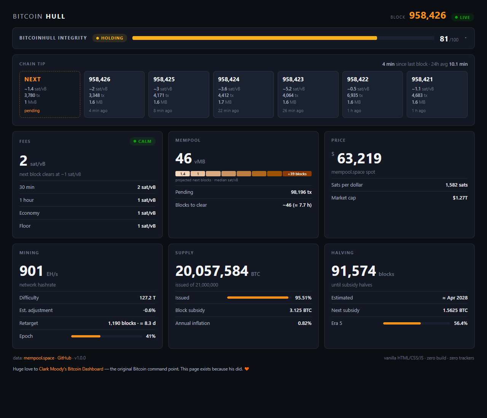

# ⎈ Bitcoinhull

**Live at [bitcoinhull.com](https://bitcoinhull.com)** (also
[abysal32-arch.github.io/bitcoinhull](https://abysal32-arch.github.io/bitcoinhull/)).

A live Bitcoin command point — the chain, the mempool, fees, price, mining,
supply, the halving, and the **BitcoinHull Integrity** score (one honest
0–100 for "is the network running clean right now"), readable at a glance.

- **Stack:** vanilla HTML/CSS/JS, zero build step, zero dependencies, zero trackers.
- **Data:** [mempool.space](https://mempool.space) public API (WebSocket push + REST fallback). One source, no keys.
- **Honesty rules:** every value is loading `—`, live, or visibly `STALE n MIN` —
  the page never shows a frozen number without telling you. The connection chip
  (`LIVE`/`POLLING`/`DEGRADED`/`DOWN`) tells the truth about the transport.
- **Deployment story:** open `index.html` in a browser. That's it. GitHub Pages
  serves this repo as-is.

In the spirit of [Clark Moody's Bitcoin Dashboard](https://bitcoin.clarkmoody.com/dashboard) —
fewer numbers, bigger type, honest states. Read-only: no wallet, no keys, ever.

v1.0.0 · QA evidence in [`tasks/task-10-polish-ship/QA.md`](tasks/task-10-polish-ship/QA.md)
